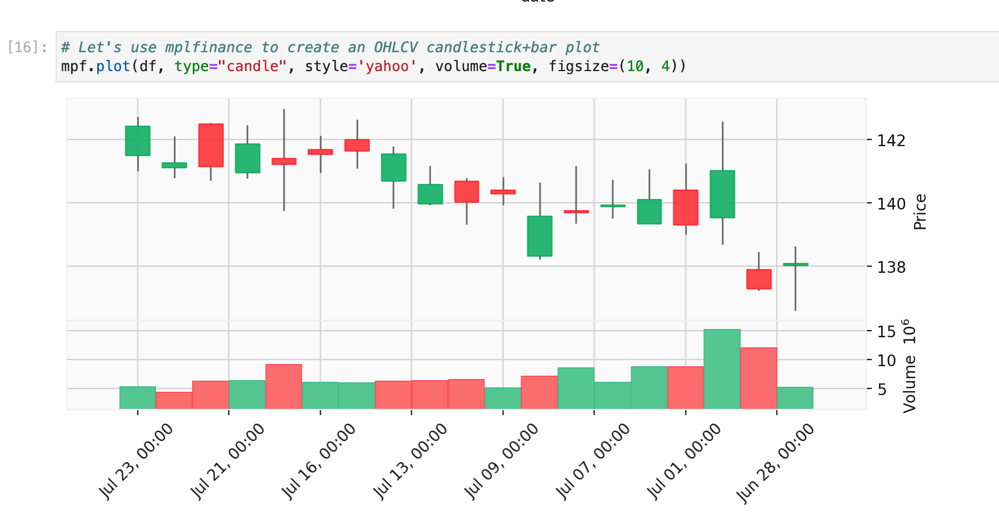
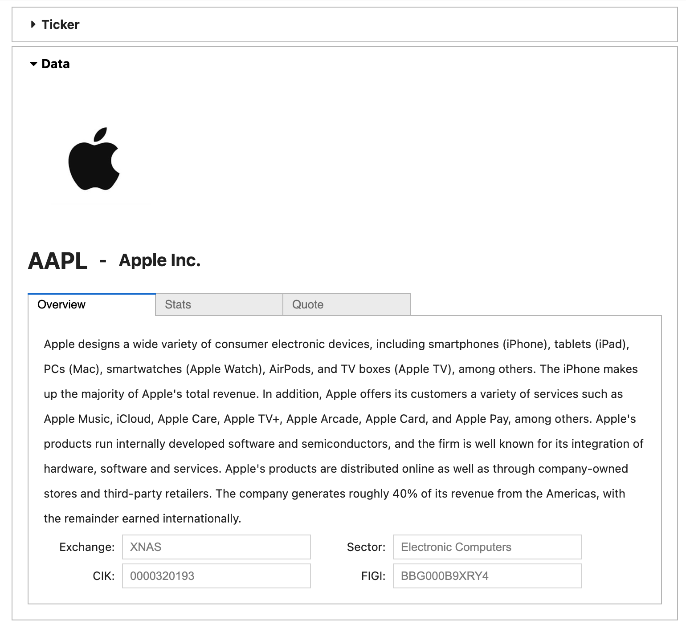

# <a href="https://polygon.io/">Polygon.io Examples</a>

Example applications, dashboards, scripts, notebooks, and other utilities built using [Polygon.io](https://polygon.io/).

## Examples

| Preview | Name | Type | Language | Frameworks / Libraries | Datasets | Difficulty (1-5) |
|:---:|:---:|:---:|:---:|:---:|:---:|:---:|
| <a href="./notebooks/1_OHLCV.ipynb"></img></a> | [OHLCV](./notebooks/1_OHLCV.ipynb) | Notebook | Python | [Pandas](https://pandas.pydata.org), [Matplotlib](https://matplotlib.org), [Plotly](https://plotly.com/python/) | [Stocks](https://polygon.io/docs/stocks/getting-started)  | 1 |
| <a href="./notebooks/2_Profile.ipynb"></img></a> | [Profile](./notebooks/2_Profile.ipynb) | Notebook | Python | [ipywidgets](https://ipywidgets.readthedocs.io/en/latest/index.html) | [Stocks](https://polygon.io/docs/stocks/getting-started)  | 1 |

# License

This software is licensed under the Apache 2.0 license. See the
[LICENSE](LICENSE) and [AUTHORS](AUTHORS) files for details.
